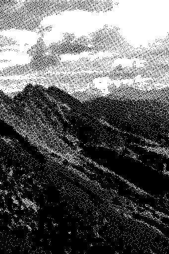
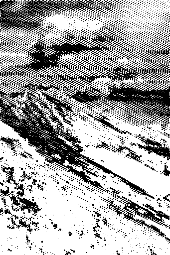
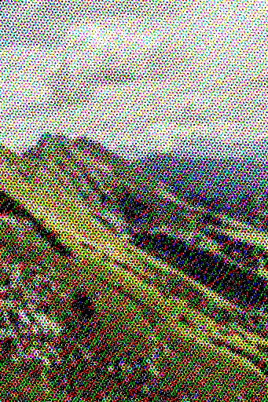

# Halftone Palette

An online tool for generating and customizing [halftone](https://en.wikipedia.org/wiki/Halftone) images. Here are some examples:

Original | Eucliean Dots | Tone Inversion | Subtractive Colors
--- | --- | --- | ---
 |  |  | 

[Try it yourself!](https://ychalier.github.io/halftone-palette/)